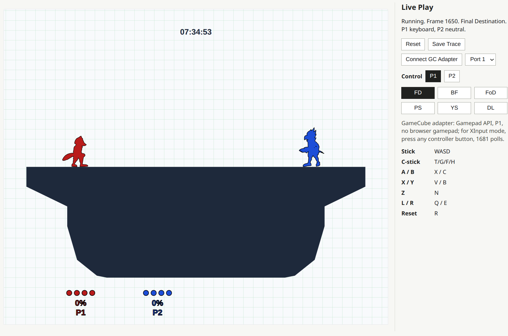

# melee-sim-light

`melee-sim-light` is a deterministic, batched SSBM-like simulator for
high-throughput RL training and replay-driven validation.

The simulator core is C. The public Python package is `melee_sim`, with a thin
NumPy API over native batch execution.

## Quick Start

Prerequisites:
- `uv`
- Git LFS
- Python 3.11 or newer
- a C compiler available as `cc`

Clone the repo:
```bash
git clone https://github.com/kyhavlov/melee-sim-light
cd melee-sim-light
git lfs install
git lfs pull
```

From another project, install the local checkout with `uv`:

```bash
uv add "melee-sim-light @ file:///path/to/melee-sim-light"
```

The simulator needs extracted game data before it can create an `EnvBatch`.
Extract it from a valid SSBM ISO:

```bash
uv run python -m melee_sim.extract_data --iso /path/to/SSBM.iso [--out-dir /path/to/my-msl-data]
```

The set of characters (and their source `.dat` files) is defined by `CHARS` in
`tools/extraction/char_registry.py`; extraction always covers the full registry, and the
generated `data/manifest.json` records which chars/stages were extracted plus the git
revision of the generating checkout, so stale data can be detected after extractors change.

By default, the extraction command creates a `data/` directory where the command is run
and can be run again in place when data needs to be refreshed. `EnvBatch()`
loads source-checkout `data/` by default. To use another data root, set `MSL_DATA_DIR` or
pass `data_dir`:

```bash
MSL_DATA_DIR=/path/to/data uv run python train.py
```

```python
env = msl.EnvBatch(batch_size=1024, data_dir="/path/to/data")
```

The resolved data directory is process-global native runtime state, so choose it
before creating simulator batches.

## Examples

### Python

The Python API is built around two objects:

- `EnvBatch` owns the native simulator instance: batch size, player count, loaded data, and the current simulator state.
- `Buffers` owns the reusable NumPy arrays for match config, controller input, observations, and outputs. Reusing one buffer object avoids per-step allocation.

A typical RL loop creates one `EnvBatch`, writes controller inputs into its bound buffers, and calls `env.step()`:
  
```python
import melee_sim as msl

with msl.EnvBatch(batch_size=2, length=128, num_players=2) as env:
    env.configure_match(
        stage=msl.Stage.FINAL_DESTINATION,
        players=[
            msl.PlayerConfig(character=msl.Character.FOX),
            msl.PlayerConfig(character=msl.Character.FALCO),
        ],
    )

    # Write player inputs for the whole reusable buffer chunk.
    fox = msl.neutral_controller((env.length, env.batch_size))
    fox.buttons.B[0, 0] = True
    fox.main_stick.x[0, 0] = 1.0
    msl.write_controller(env.controller_action_view, fox, player=0)

    neutral = msl.neutral_controller((env.length, env.batch_size))
    msl.write_controller(env.controller_action_view, neutral, player=1)

    env.reset_all()
    env.step()

    # gamestate has one extra frame: row 0 is the reset state, row 1 is after
    # the first step.
    frame_1 = env.gamestate_view[1, 0]
    fox_slot = frame_1["slots"][0]
    print(frame_1["frame_id"], fox_slot["action_id"], fox_slot["pos_x"])

    # Reuse the same arrays for the next chunk after consuming frames 0..127.
    env.reset_cursor()
```

Useful Python signatures:

```python
EnvBatch(
    batch_size: int,
    length: int = 256,
    num_players: int = 2,
    *,
    data_dir: str | os.PathLike[str] | None = None,
    observation: str = "native",
    action_format: str = "controller",
    obs_dim: int = 0,
    ucf_enabled: bool = True,
    ucf_cardinals_1_0_enabled: bool = False,
) -> None

env.buffers -> Buffers
env.allocate_buffers(*, observation: str = "native", action_format: str = "controller", obs_dim: int = 0) -> Buffers
env.configure_match(buffers: Buffers | None = None, config: MatchConfig | None = None, **overrides) -> None
env.configure_matches(configs: Sequence[MatchConfig], *, env_ids: Sequence[int] | np.ndarray | None = None, **overrides) -> None
env.bind(buffers: Buffers) -> None
env.reset_all() -> None
env.step(*, write_outputs: bool = True, write_compare: bool = False, max_frame_id: int = -1) -> None
env.reset_cursor() -> None

PlayerConfig(character: int | Character, team_id: int | None = None, facing: int | None = None)
MatchConfig(stage: int | Stage = Stage.FINAL_DESTINATION, players: tuple[PlayerConfig, ...] | None = None, ...)
```

### C Native API

The native API is built around one simulator object plus caller-owned arrays:

- `MslBatch` owns the simulator instance: batch size, player count, loaded data, and current simulator state.
- Match configs describe the starting state for each lane in the batch.
- `MslInput` arrays provide previous/current controller inputs for each lane.
- Output arrays such as `MeleeGamestate` receive observations after stepping.
- Each batch function takes a pointer plus a stride, so integrations can use their own fixed memory layout and reuse it every frame.

A typical native loop creates one `MslBatch`, initializes match configs, writes controller inputs each frame, calls `msl_batch_step_input()`, and writes observations into a caller-owned output array:

```c
#include <stdint.h>
#include <stdio.h>
#include <string.h>

#include "src/api.h"

int main(void) {
  enum { BATCH = 2, PLAYERS = 2 };

  MslBatch* batch = msl_batch_create(BATCH, PLAYERS);
  if (batch == NULL) {
    return 1;
  }

  MslMatchConfig configs[BATCH];
  memset(configs, 0, sizeof(configs));
  for (int i = 0; i < BATCH; i++) {
    configs[i].stage_id = MSL_STAGE_ID_FINAL_DESTINATION;
    configs[i].frame_id = -123;
    configs[i].players[0].char_id = MSL_CHAR_ID_FOX;
    configs[i].players[1].char_id = MSL_CHAR_ID_FALCO;
  }

  if (msl_batch_init_match(batch, (const uint8_t*)configs, sizeof(configs[0])) != 0) {
    msl_batch_destroy(batch);
    return 1;
  }

  MslInput prev[BATCH];
  MslInput input[BATCH];
  memset(prev, 0, sizeof(prev));
  memset(input, 0, sizeof(input));

  if (msl_batch_step_input(batch, (const uint8_t*)prev, sizeof(prev[0]),
                           (const uint8_t*)input, sizeof(input[0])) != 0) {
    msl_batch_destroy(batch);
    return 1;
  }

  uint8_t viewpoint[BATCH] = {0};
  MeleeGamestate out[BATCH];
  if (melee_batch_write_gamestate(batch, viewpoint, sizeof(viewpoint[0]), (uint8_t*)out,
                                  sizeof(out[0])) != 0) {
    msl_batch_destroy(batch);
    return 1;
  }

  printf("frame=%d p0_action=%u p0_x=%f\n", out[0].frame_id,
         (unsigned)out[0].slots[0].action_id, out[0].slots[0].pos_x);

  msl_batch_destroy(batch);
  return 0;
}
```

Useful C signatures:

```c
MslBatch* msl_batch_create(int batch_size, int num_players);
void msl_batch_destroy(MslBatch* batch);

int msl_batch_init_match(MslBatch* batch, const uint8_t* config_bytes,
                         size_t config_stride_bytes);
int msl_batch_init_match_masked(MslBatch* batch, const uint8_t* config_bytes,
                                size_t config_stride_bytes, const uint8_t* mask_bytes,
                                size_t mask_stride_bytes);

int msl_batch_step_input(MslBatch* batch, const uint8_t* prev_input_bytes,
                         size_t prev_input_stride_bytes, const uint8_t* input_bytes,
                         size_t input_stride_bytes);
int melee_batch_write_gamestate(const MslBatch* batch, const uint8_t* viewpoint_player_bytes,
                                size_t viewpoint_player_stride_bytes, uint8_t* out_bytes,
                                size_t out_stride_bytes);
```

## Viewer



There's a web viewer in `tools/viewer` that supports both a live play mode
for driving an exported WASM version of the sim with keyboard/controller input, and watching
saved replay traces that can be written from sim gamestate data. It uses the
[`@gcpreston/slippi-viewer`](https://www.npmjs.com/package/@gcpreston/slippi-viewer)
project for game visualization:

Prerequisites:

- Emscripten activated so `emcc` is on `PATH`, for the WASM build
- Node.js/npm available for the renderer build
- extracted simulator data; defaults to source-checkout `data/`, or set `MSL_DATA_DIR`
- network access on the first build to download character display assets

```bash
npm --prefix tools/viewer/slippi-viewer install
make viewer-build
make viewer
```

Open `http://127.0.0.1:8001/tools/viewer/`.

Modelplay and the live viewer both write `*.msltrace.json`. The trace format is
documented in `tools/viewer/TRACE_FORMAT.md`; it is compact JSON with
sparse-delta frame, input, and item streams. `make viewer-build` downloads the
display assets into `build/cache/viewer-zips/` on first use and
verifies them by checksum on later builds.

## Runtime API Reference

The native runtime surface is declared in `src/api.h`. The Python wrapper uses
the same structs and layout, but this section describes the data model in C
terms.

Core runtime calls:

| call | purpose |
| --- | --- |
| `msl_batch_create(batch_size, num_players)` | create independent match lanes |
| `msl_batch_destroy(batch)` | free native runtime storage |
| `msl_batch_init_match(batch, configs, stride)` | reset every lane from `MslMatchConfig` |
| `msl_batch_init_match_masked(batch, configs, stride, mask, mask_stride)` | reset selected lanes |
| `msl_batch_step_input(batch, prev, prev_stride, input, input_stride)` | advance every lane one frame |
| `melee_batch_write_gamestate(batch, viewpoints, viewpoint_stride, out, out_stride)` | write one `MeleeGamestate` per lane |
| `msl_batch_write_terminal(batch, out, stride, max_frame_id)` | write `MslTerminal` done flags |
| `msl_batch_reseed_seed(...)` | restore replay/validation seed state |

Data root:

- Direct C callers should set `MSL_DATA_DIR` before `msl_batch_create()` when
  using extracted data from a non-default directory.
- If `MSL_DATA_DIR` is unset, native loaders fall back to source-checkout
  `data/`.
- The resolved data root is process-global native state; choose it before
  creating simulator batches.

Timing contract:

- `msl_batch_init_match()` writes the initial state.
- Each `msl_batch_step_input()` consumes a previous and current `MslInput` row.
- Melee input logic depends on previous-frame button/stick state, so callers
  should preserve and pass the previous input used for each lane.
- `melee_batch_write_gamestate()` writes the post-step state currently owned by
  the batch.

Batch functions take a pointer plus a byte stride. This lets callers keep fixed
arrays, struct-of-arrays wrappers, or padded records without runtime allocation.

## Native Input And Match Config

`MslMatchConfig` starts or resets a lane:

| field | type | values / range | meaning |
| --- | --- | --- | --- |
| `stage_id` | `uint32_t` | `MSL_STAGE_ID_*` | GALE01/Slippi stage id |
| `frame_id` | `int32_t` | normal match start `-123` | starting frame id |
| `frame_pre_random_seed` | `uint32_t` | any `uint32_t` | starting RNG seed |
| `match_damage_ratio` | `float` | `0.0` or positive | global damage ratio; `0.0` means default `1.0` |
| `num_players` | `uint8_t` | `0`, `2`, or `4` | `0` means batch default; otherwise must match batch |
| `is_teams` | `uint8_t` | `0` or `1` | nonzero for teams |
| `stock_count` | `uint8_t` | `0..255` | `0` means normal 4-stock start |
| `camera_mode` | `uint8_t` | `0` or `1` | `0` normal gameplay camera, `1` free camera |
| `players[4]` | `MslMatchPlayerConfig[4]` | active entries `< num_players` | per-player character/team/facing |

`MslMatchPlayerConfig`:

| field | type | values / range | meaning |
| --- | --- | --- | --- |
| `char_id` | `uint8_t` | `MSL_CHAR_ID_FOX=1`, `MSL_CHAR_ID_FALCON=2`, `MSL_CHAR_ID_SHEIK=7`, `MSL_CHAR_ID_MARTH=18`, `MSL_CHAR_ID_ZELDA=19`, `MSL_CHAR_ID_FALCO=22` | GALE01/Slippi character id |
| `team_id` | `uint8_t` | `0=red, 1=blue, 2=green` | team assignment |
| `facing` | `uint8_t` | `0` or `1` | `0` left, `1` right; neutral spawn facing is derived when unset |

`MslInput` contains one raw controller row per source player:

| field | type | values / range | native meaning |
| --- | --- | --- | --- |
| `p[4].buttons` | `uint16_t` | OR of `MSL_BUTTON_*` | packed digital button mask |
| `p[4].main_x`, `main_y` | `int8_t` | `-80..80` | raw main-stick axes |
| `p[4].c_x`, `c_y` | `int8_t` | `-80..80` | raw C-stick axes |
| `p[4].l`, `r` | `uint8_t` | `0..255` | raw analog trigger values |

Button masks:

| constant | value |
| --- | --- |
| `MSL_BUTTON_A` | `0x0100` |
| `MSL_BUTTON_B` | `0x0200` |
| `MSL_BUTTON_X` | `0x0400` |
| `MSL_BUTTON_Y` | `0x0800` |
| `MSL_BUTTON_Z` | `0x0010` |
| `MSL_BUTTON_L` | `0x0040` |
| `MSL_BUTTON_R` | `0x0020` |
| `MSL_BUTTON_START` | `0x1000` |
| `MSL_BUTTON_D_UP` | `0x0008` |
| `MSL_BUTTON_D_DOWN` | `0x0004` |

## Native Gamestate Output

`MeleeGamestate` is the policy-facing state written by
`melee_batch_write_gamestate()`.

Player slots are viewpoint-relative: `slots[0]` is self, then allies by source
player index, then opponents by source player index. Unused slots have
`present == 0`.

Top-level fields:

| field | type | values / range | shape |
| --- | --- | --- | --- |
| `frame_id` | `int32_t` | match frame id (starts at -123 in pre-match countdown) | scalar |
| `frame_pre_random_seed` | `uint32_t` | any `uint32_t` | scalar |
| `stage_id` | `uint32_t` | `MSL_STAGE_ID_*` | scalar |
| `num_players` | `uint8_t` | `2` or `4` | scalar |
| `viewpoint_player` | `uint8_t` | `0..num_players-1` | scalar |
| `is_teams` | `uint8_t` | `0` or `1` | scalar |
| `stage` | `MeleeStage` | stage-owned state | scalar |
| `slots` | `MeleePlayer` | viewpoint-relative players | `[4]` |
| `items` | `MeleeItem` | active/inactive item slots | `[15]` |

`MeleePlayer`:

| field | type | values / range |
| --- | --- | --- |
| `present` | `uint8_t` | `0` or `1` |
| `source_player` | `uint8_t` | `0..num_players-1` when present |
| `team_relation` | `uint8_t` | `0` self, `1` ally, `2` opponent |
| `team_id` | `uint8_t` | team assignment |
| `pos_x`, `pos_y` | `float` | world coordinates |
| `speed_air_x_self`, `speed_ground_x_self`, `speed_y_self` | `float` | self velocity components |
| `speed_x_attack`, `speed_y_attack` | `float` | attack/knockback velocity components |
| `percent` | `float` | damage percent, `0..999.9` |
| `shield_hp` | `float` | shield health, `0..60` |
| `action_id` | `uint16_t` | GALE01 action id |
| `action_frame` | `int16_t` | current action frame |
| `hitlag`, `hitstun` | `uint16_t` | remaining frames |
| `char_id` | `uint8_t` | `MSL_CHAR_ID_*` |
| `stocks` | `uint8_t` | remaining stocks |
| `facing` | `uint8_t` | `0` left, `1` right |
| `on_ground` | `uint8_t` | `0` or `1` |
| `jumps_left` | `uint8_t` | remaining air jumps |
| `hurtbox_state` | `uint8_t` | GALE01 hurtbox state id |
| `invulnerable` | `uint8_t` | `0` or `1` |

`MeleeItem` slots are fixed-capacity. Inactive slots have `exists == 0`.

| field | type | values / range |
| --- | --- | --- |
| `exists` | `uint8_t` | `0` or `1` |
| `state` | `uint8_t` | item state id |
| `type` | `uint16_t` | item kind/type id |
| `owner` | `int8_t` | source player id, or `-1` if none/unknown |
| `instance_id`, `attack_id`, `attack_instance` | `uint16_t` | attack/staling identity |
| `direction` | `float` | facing/direction scalar |
| `vel_x`, `vel_y` | `float` | world velocity |
| `pos_x`, `pos_y` | `float` | world coordinates |
| `damage` | `uint16_t` | item damage value |
| `timer` | `float` | item timer/frame counter |
| `spawn_id` | `uint32_t` | deterministic spawn identity |
| `misc0`, `misc1`, `misc2`, `misc3` | `uint8_t` | item-specific bytes |

`MeleeStage` currently exposes Randall on Yoshi's Story:

| field | type | values / range |
| --- | --- | --- |
| `randall.exists` | `uint8_t` | `0` or `1` |
| `randall.x`, `randall.y` | `float` | world coordinates |

## Terminal Output

`MslTerminal` is written by `msl_batch_write_terminal()`:

| field | type | values / range | meaning |
| --- | --- | --- | --- |
| `frame_id` | `int32_t` | current frame id | current frame |
| `stage_id` | `uint32_t` | `MSL_STAGE_ID_*` | current stage |
| `done` | `uint8_t` | `0` or `1` | any terminal condition |
| `match_ended` | `uint8_t` | `0` or `1` | in-game match end |
| `stockout` | `uint8_t` | `0` or `1` | player/team out of stocks |
| `max_frame_reached` | `uint8_t` | `0` or `1` | caller-specified frame cutoff |

## Replay Validation Helper

For quick triage of a single Slippi replay, `tools.eval.validate_replay` builds
validation replay buffers directly from `.slp/.slpz` input and prints one-step or rollout results to stdout
without updating committed validation reports:

```bash
uv run python -m tools.eval.validate_replay \
  --replay /path/to/Game.slp \
  --mode rollout
```

Use `--mode one-step` for direct seeded one-step validation, or `--mode both`
to run both views. By default the tool selects human player ports from the
replay; pass `--ports 1,2` to choose ports explicitly.
